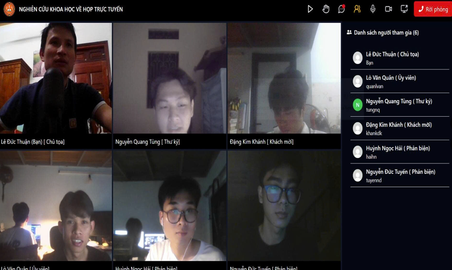
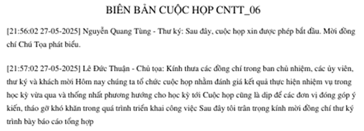
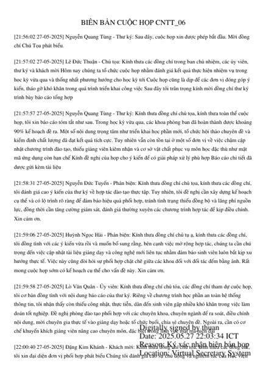

# Huấn luyện mô hình Speech to Text cho ngôn ngữ tiếng Việt và ứng dụng vào hệ thống họp trực tuyến

Trong nghiên cứu này, chúng tôi xây dựng ứng dụng phòng họp trực tuyến có áp dụng mô hình Speech to Text (STT) để chuyển đổi nội dung cuộc họp sang văn bản. Để chức năng chuyển đổi sang văn bản của cuộc họp có độ chính xác cao, chúng tôi tiến hành đánh giá một số mô hình STT hỗ trợ tiếng Việt. Từ đó chúng tôi lựa chọn mô hình PhoWhisper (là mô hình tốt nhất) để tiếp tục fine-tune với bộ dữ liệu ViSpeech, đây là bộ dữ liệu phân biệt giọng vùng miền và giới tính. Chúng tôi sử dụng bộ dữ liệu Mozilla Common Voice 17 để đánh giá mô hình PhoWhisper trước và sau khi fine-tune. Chúng tôi thấy rằng sau khi fine-tune, mô hình mới cho kết quả là 10.34% với độ đo WER, thấp hơn nhiều so với mô hình PhoWhisper gốc (cho kết quả 37.04% với độ đo WER). Hệ thống phòng họp trực tuyến của chúng tôi đã được triển khai trên máy chủ với nhiều chức năng và cho kết quả chuyển đổi giọng nói sang văn bản có chất lượng tốt.

## LINK: https://virtualsecretary.click/

- Tài khoản thử nghiệm: quanlvan mk: 01/01/2003
- Tài khoản thử nghiệm: khankdk mk: 01/01/2003

## 🌐 Tính năng chính

- 🔒 Tạo và tham gia phòng họp với mã bảo mật
- 🎥 Gọi video nhóm thời gian thực (WebRTC)
- 💬 Trò chuyện (chat) trong phòng họp
- 👥 Quản lý thành viên và phân quyền (host, participant)
- 📱 Giao diện thân thiện trên cả máy tính và di động
- 📷 Hỗ trợ chia sẻ màn hình (screen sharing)
- 🔔 Thông báo khi có thành viên tham gia / rời cuộc họp
- 💬 Chuyển đổi giọng nói trong cuộc họp thành văn bản, cho phép sửa, tải về file word, pdf(Bản chuyển đổi gốc), Audio ghi âm.

## 🛠️ Công nghệ sử dụng

- **Frontend**: ReactJS + TypeScript + TailwindCSS
- **Backend**: Spring Boot
- **AI**: Whisper, Python
- **Giao tiếp thời gian thực**: WebRTC, Websocket / STOMP
- **Xác thực**: JWT
- **Triển khai**: Nginx, VPS

# Thử nghiệm và huấn luyện mô hình

Trong nghiên cứu này, để áp dụng mô hình phù hợp vào hệ thống phòng họp trực tuyến, chúng tôi đã đánh giá một số mô hình hỗ trợ tiếng việt như Whisper, PhoWhiser, VietASR được cung cấp mô hình miễn phí. Sau đó, chúng tôi Fine-Tune mô hình tốt nhất với bộ dữ liệu tiếng việt để kết quả được tốt hơn khi áp dụng vào hệ thống.

Kết quả đánh giá các mô hình như sau

| Model       | WER      | CER      |RTF      |
|-------------|-------------|-------------|-------------|
| Whisper  | 37.91  | 20.35  | 27.22  |
| PhoWhisper  | 37.91  | 20.35  | 26.46  |
| VietASR  | 37.91  | 20.35  | 3.90  |
| PhoWhisper fine-tuned  | 37.91  | 20.35  | 54.22  |

## Kết quả thực tế
Khi áp dụng mô hình PhoWhisper fine-tuned trong hệ thống phòng họp trực tuyến, chúng tôi thấy rằng hệ thống hoạt động ổn định và cho văn bản có độ chính xác cao trong điều kiện họp thực tế. Hệ thống họp đã được triển khai tại  https://virtualsecretary.click/. Hình ảnh thực tế và kết quả nhận diện giọng nói sang văn bản được thể hiện trong ảnh dưới đây.

### Hình ảnh cuộc họp

### Biên bản cuộc họp hiển thị trên web

### Nội dung file biên bản PDF

